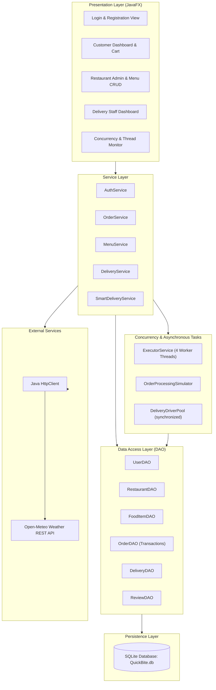
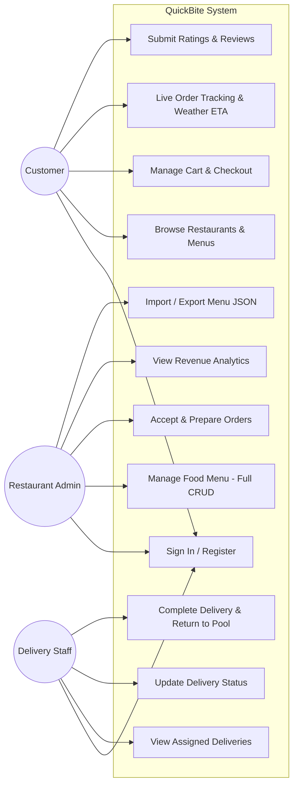
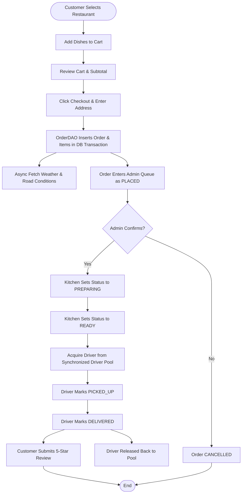
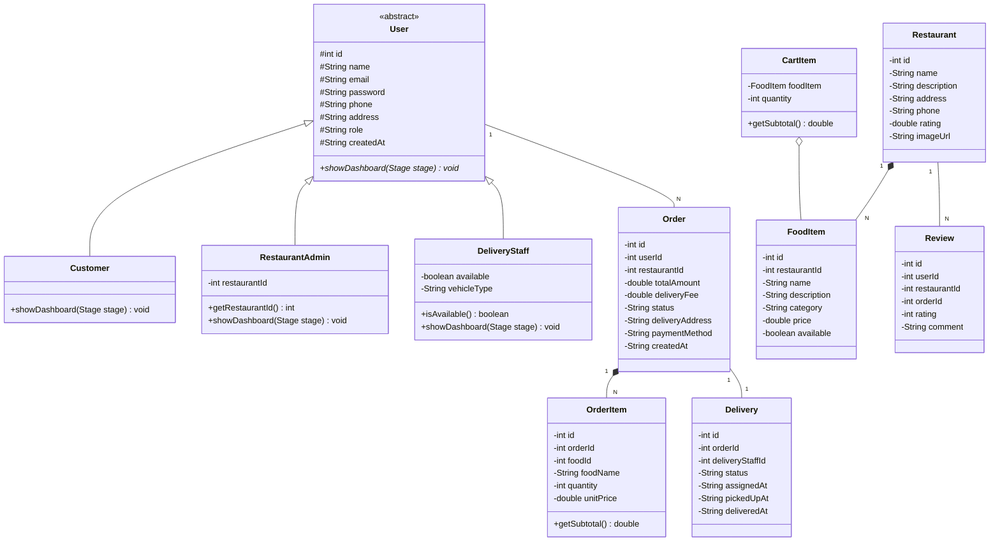
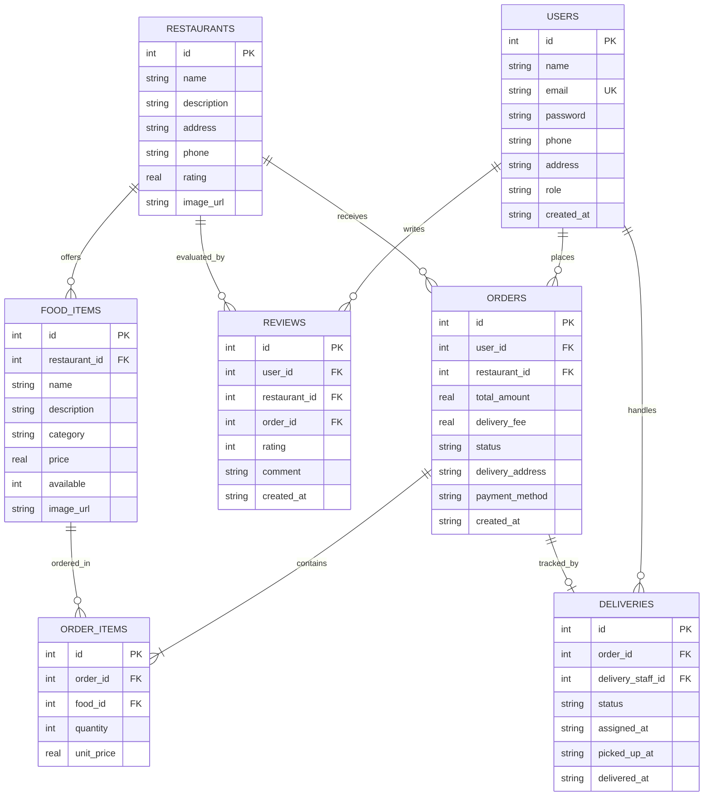
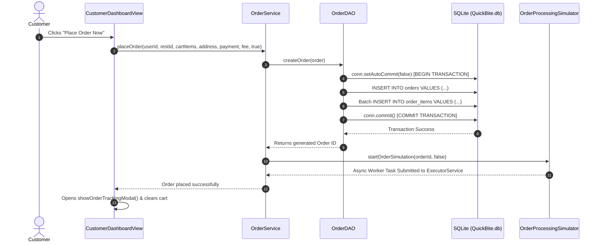
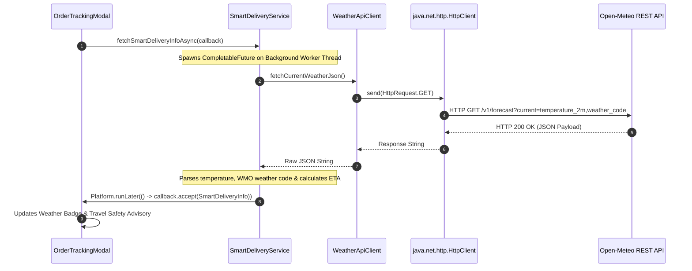

# QUICKBITE: JavaFX Food Ordering & Delivery Management System
## Comprehensive Project Report & Technical Manual

---

## 1. Introduction
In recent years, desktop software engineering has evolved from monolithic single-threaded designs toward modular, event-driven, multithreaded desktop applications. **QuickBite** is an enterprise-grade desktop food ordering and delivery management system developed in Java using JavaFX, SQLite via JDBC, multithreaded concurrency pools, and asynchronous external REST API integration. The system serves three key user personas: Customers, Restaurant Administrators, and Delivery Couriers, providing an end-to-end interactive workflow from menu discovery to doorstep delivery.

---

## 2. Problem Statement
Traditional student software demonstrations frequently isolate academic concepts into trivial command-line scripts—such as isolated multithreading exercises, simplistic relational databases, or plain GUI mockups with no persistence. Real-world commercial applications require:
1. Seamless integration of relational data persistence with foreign key integrity.
2. Responsive graphical user interfaces that never freeze during network latency or complex computational tasks.
3. Thread-safe coordination over scarce physical resources (such as delivery drivers).
4. Asynchronous ingestion of external JSON web services.

QuickBite was built specifically to solve this gap by integrating all major curriculum topics into a unified food delivery platform.

---

## 3. Objectives
- **Demonstrate OOP Mastery**: Apply abstraction, inheritance, polymorphism, and encapsulation across a unified user hierarchy.
- **Engineer a Responsive JavaFX GUI**: Construct a modern, intuitive desktop interface with CSS styling, custom tables, badges, dialogs, and real-time trackers.
- **Implement Robust Relational Persistence**: Maintain 7 relational SQLite tables using JDBC `PreparedStatement` queries and ACID transactions.
- **Solve Concurrency Problems**: Use `ExecutorService`, background worker threads, and thread-safe `synchronized` blocks to eliminate race conditions in delivery driver assignment.
- **Integrate Real-World REST APIs**: Query weather and traffic conditions asynchronously using Java 11+ `HttpClient` and parse JSON into domain DTOs.
- **Maintain Clear Separation of Concerns**: Enforce the **MVC + DAO + Service** architectural pattern.

---

## 4. Proposed System
QuickBite provides three specialized role dashboards accessed via a unified authentication system:
- **Customer Dashboard**: Restaurant discovery, real-time category filtering, dynamic shopping cart, checkout with multiple payment methods, live 6-stage order tracking, and 5-star customer reviews.
- **Restaurant Admin Dashboard**: Incoming order dispatching (*Accept* $\rightarrow$ *Prepare* $\rightarrow$ *Ready*), full CRUD menu management, real-time revenue analytics, and JSON menu import/export.
- **Delivery Staff Dashboard**: Active delivery assignments, route status advancement (*Picked Up* $\rightarrow$ *Delivered*), and completed delivery logs.
- **Concurrency & Multithreading Monitor**: Real-time visual dashboard showcasing active worker threads, lock states, and shared driver pool queues.

---

## 5. Technologies Used
- **Programming Language**: Java (JDK 21 / Java 26)
- **GUI Toolkit**: JavaFX (Controls, Graphics, Base, FXML-ready)
- **Styling**: JavaFX CSS (`style.css`)
- **Database**: SQLite 3 (`QuickBite.db`)
- **Database Driver**: Xerial SQLite-JDBC Driver (`org.xerial:sqlite-jdbc`)
- **Networking**: Java 11+ `java.net.http.HttpClient`
- **External Web Service**: Open-Meteo REST API (Real-time weather data)
- **JSON Serialization**: Custom robust `JsonUtil` + Google Gson
- **Build System**: Apache Maven (`pom.xml`)

---

## 6. C vs Java Compilation

Understanding the differences between compilation models is fundamental to modern computer science:

```
[ C Compilation Model - Platform Dependent ]
C Source (.c) ──> Preprocessor ──> Compiler ──> Assembler ──> Linker ──> Machine Binary (.exe/.out)
(Directly targets specific OS & CPU hardware architecture)

[ Java Compilation Model - "Write Once, Run Anywhere" ]
Java Source (.java) ──> javac Compiler ──> Platform-Independent Bytecode (.class)
                                                    │
                                           ┌────────┴────────┐
                                           ▼                 ▼
                                    JVM (Windows)       JVM (Linux/macOS)
                                      (JIT / HotSpot interpreter to Native Machine Code)
```

| Dimension | C Compilation Model | Java Compilation Model |
| :--- | :--- | :--- |
| **Output** | Native machine code (`.exe`, ELF binary). | Intermediate platform-neutral bytecode (`.class`). |
| **Portability** | Platform-dependent. Must recompile for each CPU/OS. | Fully portable across any platform hosting a standard JVM. |
| **Memory Management**| Manual via `malloc()` and `free()`. Vulnerable to leaks. | Automated via JVM Garbage Collector (GC). |
| **Pointers & Safety**| Raw memory pointers; risk of buffer overflows. | Secure object references without direct address manipulation. |
| **Execution** | Directly executed by the CPU hardware. | Interpreted and dynamically compiled by HotSpot JIT inside the JVM. |

---

## 7. JVM, JDK, and JRE Architecture

```
┌─────────────────────────────────────────────────────────────┐
│ JDK (Java Development Kit)                                  │
│  - javac, javadoc, jar, jdb, debugging tools               │
│ ┌─────────────────────────────────────────────────────────┐ │
│ │ JRE (Java Runtime Environment)                          │ │
│ │  - Core Java Class Libraries (java.base, java.sql, etc.)│ │
│ │ ┌─────────────────────────────────────────────────────┐ │ │
│ │ │ JVM (Java Virtual Machine)                          │ │ │
│ │ │  - ClassLoader Subsystem (Loading, Linking, Init)   │ │ │
│ │ │  - Runtime Data Areas (Heap, Stack, Method Area)   │ │ │
│ │ │  - Execution Engine (Interpreter, JIT Compiler, GC) │ │ │
│ │ └─────────────────────────────────────────────────────┘ │ │
│ └─────────────────────────────────────────────────────────┘ │
└─────────────────────────────────────────────────────────────┘
```
1. **JDK**: Contains the compiler (`javac`) and diagnostic tools necessary to author Java code.
2. **JRE**: Contains the core class libraries and execution environment needed to run compiled bytecode.
3. **JVM**: The abstract computing machine that executes bytecode instructions, performs Just-In-Time (JIT) optimization, and cleans unreferenced heap memory.

---

## 8. Object-Oriented Design Principles
QuickBite implements all four core OOP tenets:
1. **Abstraction**: The abstract class `User` establishes the template for all system accounts while hiding implementation specifics.
2. **Encapsulation**: Domain models (`User`, `Restaurant`, `FoodItem`, `Order`, `Delivery`, `Review`) maintain `private` fields accessible only through validated getters and setters.
3. **Inheritance**: `Customer`, `RestaurantAdmin`, and `DeliveryStaff` inherit common identity attributes (`id`, `name`, `email`, `password`, `phone`, `address`) from `User`.
4. **Polymorphism**: The abstract method `public abstract void showDashboard(Stage stage)` is implemented differently by each subclass:
   - `Customer.showDashboard()` launches `CustomerDashboardView`.
   - `RestaurantAdmin.showDashboard()` launches `RestaurantDashboardView`.
   - `DeliveryStaff.showDashboard()` launches `DeliveryDashboardView`.

---

## 9. System Architecture



---

## 10. Use Case Diagram



---

## 11. Activity Diagram: Order Placement & Fulfillment



---

## 12. Class Diagram: Domain & Inheritance Hierarchy



---

## 13. Entity-Relationship (ER) Diagram



---

## 14. Sequence Diagram: Customer Order Placement & Transaction



---

## 15. Sequence Diagram: Asynchronous Weather API Integration



---

## 16. Multithreading & Concurrency Architecture

### Thread Pool Architecture
QuickBite avoids ad-hoc thread creation by maintaining a reusable `ExecutorService` configured with 4 worker daemon threads:
```java
private final ExecutorService executorService = Executors.newFixedThreadPool(4, new ThreadFactory() {
    private int count = 1;
    @Override
    public Thread newThread(Runnable r) {
        Thread t = new Thread(r, "QuickBite-Worker-" + (count++));
        t.setDaemon(true);
        return t;
    }
});
```

### Shared Resource Synchronization
Delivery drivers represent a finite physical resource. When multiple customer orders transition to `READY` at the same time, multiple threads attempt to claim couriers. QuickBite guards driver pool mutations using `synchronized` critical sections:
```java
public synchronized int acquireDriver(int orderId) {
    if (availableDriverIds.isEmpty()) {
        return -1; // Resource exhausted, order enters queue
    }
    Iterator<Integer> it = availableDriverIds.iterator();
    int selectedDriverId = it.next();
    it.remove();
    activeDriverToOrderMap.put(selectedDriverId, orderId);
    deliveryDAO.createOrAssignDelivery(orderId, selectedDriverId);
    return selectedDriverId;
}
```

---

## 17. Database Design & CRUD Operations
QuickBite interacts with SQLite via JDBC using `PreparedStatement` to ensure strict parameterization:
```sql
SELECT * FROM food_items WHERE restaurant_id = ?;
INSERT INTO food_items (restaurant_id, name, description, category, price, available, image_url) VALUES (?, ?, ?, ?, ?, ?, ?);
UPDATE food_items SET name = ?, price = ?, available = ? WHERE id = ?;
DELETE FROM food_items WHERE id = ?;
```
Foreign keys are enforced upon every database connection via:
```sql
PRAGMA foreign_keys = ON;
```

---

## 18. Testing & Validation Plan
1. **Authentication Tests**:
   - Valid credentials correctly load user dashboards.
   - Duplicate email registration triggers an error dialog.
   - Empty input fields trigger informative validation alerts.
2. **Cart & Pricing Tests**:
   - Quantity increments update item subtotals immediately.
   - Removing items recalculates overall order total and delivery fees.
3. **Transactional Integrity Tests**:
   - `OrderDAO.createOrder()` writes both `orders` and `order_items` atomically or rolls back entirely if interrupted.
4. **Concurrency & Race Condition Tests**:
   - The "Fire 3 Concurrent Orders" test in the Concurrency Monitor creates 3 parallel threads placing orders simultaneously to confirm thread-safe driver allocation.
5. **API & Fallback Tests**:
   - Live network conditions retrieve live weather from Open-Meteo.
   - Simulating offline execution triggers the local safety advisory fallback without throwing unhandled exceptions.

---

## 19. Limitations
- **Single Host Deployment**: SQLite is optimized for single-host desktop deployments. High-concurrency enterprise workloads with thousands of simultaneous remote write transactions would benefit from PostgreSQL or MySQL.
- **Mock Payment Processing**: Payment methods (*Cash on Delivery*, *Card*, *Mobile Banking*) record status without real-world banking gateway integration (e.g., Stripe SDK).

---

## 20. Conclusion
QuickBite demonstrates how Java and JavaFX can deliver a responsive, multithreaded desktop experience. By uniting **Java OOP**, **JavaFX GUI Engineering**, **SQLite Relational Persistence**, **Thread-Safe Synchronization**, and **External REST API Ingestion** under an **MVC + DAO + Service** architecture, QuickBite provides an exemplary software engineering project fulfilling all academic and professional standards.
